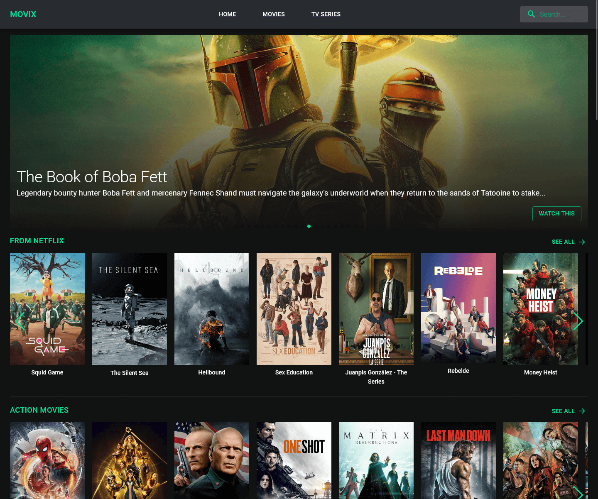

# MOVIX - A Remix Movie App

## Movies app built with Remix, MUI and TMDB API.



## Docs

- [Remix Docs](https://remix.run/docs)
- [NUI Docs](https://mui.com/getting-started/installation/)

## Deployment

After having run the `create-remix` command and selected "Vercel" as a deployment target, you only need to [import your Git repository](https://vercel.com/new) into Vercel, and it will be deployed.

If you'd like to avoid using a Git repository, you can also deploy the directory by running [Vercel CLI](https://vercel.com/cli):

```sh
npm i -g vercel
vercel
```

It is generally recommended to use a Git repository, because future commits will then automatically be deployed by Vercel, through its [Git Integration](https://vercel.com/docs/concepts/git).

## Development

To run your Remix app locally, make sure your project's local dependencies are installed:

```sh
yarn install
```

Then, add your [TMDB](https://www.themoviedb.org/) API key to your `.env` file, see `.env.example` file for your reference.

Afterwards, start the Remix development server like so:

```sh
yarn dev
```

Open up [http://localhost:3000](http://localhost:3000) and you should be ready to go!

If you're used to using the `vercel dev` command provided by [Vercel CLI](https://vercel.com/cli) instead, you can also use that, but it's not needed.
